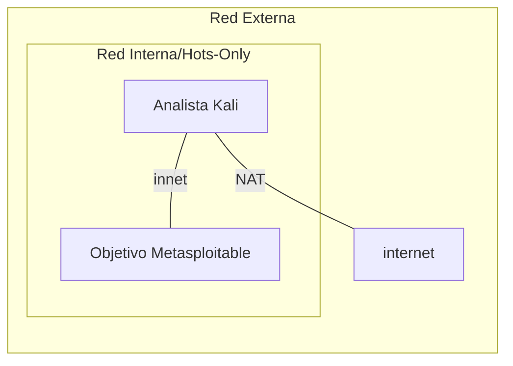
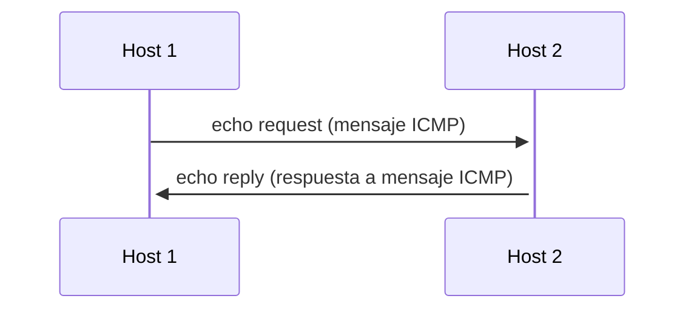
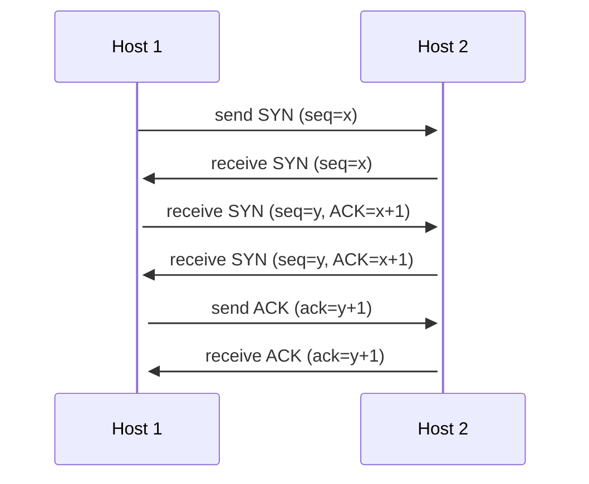

# Repaso para estudiar

## 1. Introduccion

El por que de esta practica es el `reconocimiento`, este es un paso necesario
antes de cualquier actividad realizada por un atacante, al igual que para
plantear una estrategia defensiva se debe saber las condiciones del entorno.

### Diagrama de red



Para esta configuracion, se debe agregar 2 interfaces a la maquina `Analista`:

1. NAT:(Network Address Translation o Traducción de Direcciones de Red) es un modo de conexión que permite a una máquina virtual (VM) acceder a Internet y a otras redes usando la dirección IP del equipo físico (host) como intermediario
2. red local con nombre de red `intnet`: esto vendria a ser un switch

En cambio para la maquina `Objetivo`:

1. red local con nombre de red `intnet` osea el mismo configurado para `Analista`

Una vez que se haga la configuracion fisica [^1] se debe hacer la configuracion
de ip de cada maquina, esto mediante el comando `ip`

```bash
# Listar todas las interfaces y mostrar info
ip a
# Apagar una interfaz
sudo ip link set dev interfaz down # capa 2
# Configurar ip estatica
# Borrar ip (si tiene)
sudo ip addr flush dev interfaz
# Agregar ip
sudo ip addr add 192.168.11.22/24 dev interfaz # capa 3
# Encender interfaz
sudo ip link set dev interfaz up # capa 2
```

El comando agregar es capa de red [^3] porque asigna los identificadores logicos
para el enrutamiento de paquetes
Y los de down y up son capa de enlace de datos [^2] porque controlan el estado
logico de la interfaz de red

### Preguntas

- Que es el `reconocimiento`

## 2. Instruccion Paso a Paso

### 2.2 comando ping

Usado para revisar la conexion con un host

<https://es.wikipedia.org/wiki/Ping>
<http://www.tcpipguide.com/free/index.htm>

```bash
ping direccion
```

resultado esperado:

| Tamaño de paquete | Direccion       | Secuencia del paquete | TTL    | tiempo (RTT)   |
| ----------------- | --------------- | --------------------- | ------ | -------------- |
| 64 bytes          | 142.251.214.238 | icmp_seq=2            | ttl=64 | tiempo=0.029ms |

- Tamaño de paquete: viene dado por la suma de los siguientes
  - Encabezado IP: el [encabezado IP](https://es.wikipedia.org/wiki/IPv4)
    o cabezera IP que tiene un tamaño de 20 bytes
  - ICMP: [Internet Control Message Protocol](https://es.wikipedia.org/wiki/Protocolo_de_control_de_mensajes_de_Internet)
    establece un minimo de 8 bytes que se reparten entre: tipo de mensaje
    Code, Checksum, identificador y secuencia numerica; adicionalmente,
    puede enviar datos extras opcionales
- Direccion: ipv4 o 6
- Secuencia del paquete: es el valor de la secuencia numerica definida en el protocolo
  correspondiente a dicho paquete
- TTL: por sus siglas [Time to Live](https://www.arsys.es/blog/que-es-el-ttl-y-para-que-sirve)
  es un valor que se asigna a los paquetes de datos para limitar su tiempo
  en circulacion. Cada vez que un paquete pasa por un router le disminuye
  el valor al TTL en uno y cuando llegue a cero lo descarta. En Unix y Linux
  el valor estandar es 64 mientras que Windows 128 (por cuestiones de compatibilidad
  con pilas de red antiguas)
- Tiempo (RTT): Mide el [Round-trip Time](https://www.geeksforgeeks.org/computer-networks/what-is-rttround-trip-time/)
  o tiempo de ida y vuelta, se calcula con
  `tiempo llegada - tiempo salida`. Los valores esperados son:

  | Conexion                                        | RTT esperado (ms) |
  | ----------------------------------------------- | ----------------- |
  | Loopback local                                  | < 0.1             |
  | Router local (Gateway LAN por cable)            | 1 - 3             |
  | Router local (Wi-Fi)                            | 2 - 15            |
  | Servidor en el mismo país/región                | 10 - 30           |
  | Conexión intercontinental (vía fibra submarina) | 100 - 250         |
  | Enlace Satelital (GEO)                          | 500 - 700         |

#### Flujo de comunicacion



Un `echo reply` es exactamente igual que un `echo request` solo
que cambia el tipo de 8 a 0

### Reconocimiento pasivo

La pagina presenta distintas listas de informacion como:

- background:
- network:
  - ip delegation:
- IP Geolocation
- SSL/TLS
- sender policy framework:
- dmarc:
- Web Trackers:

## 3. Reconocimiento

### Descubrir host

nmap -sn IP

aka ping sweep, en una red local utiliza solicitudes `ARP`, a traves de un enrutador hace el funcionamiento normal de `ping`

El flag -sn (ping scan) solo verifica si el host está activo, sin
escanear puertos. Es útil para un reconocimiento inicial rápido y silencioso.

### Escaneo ARP

nmap -PR 192.168.X.0/24
El flag -PR usa el protocolo ARP (capa [^2] del modelo OSI) para
descubrir hosts. Es extremadamente eficiente en redes locales porque ARP no puede ser
bloqueado por firewalls de capa [^3].

## 4. Escaneo de Puertos

### TCP: 3 way Handshake

<https://www.youtube.com/watch?v=s224abftZK4>



### SYN (Stealth Scan)

nmap -sS 192.168.X.B
El escaneo SYN (también llamado half-open scan) envía un
paquete SYN y espera respuesta

No completa el 3-Way Handshake, lo que lo hace más sigiloso y rápido.

### Escaneo UDP

sudo nmap -sU 192.168.X.B
UDP es un protocolo sin conexión. NMAP envía paquetes UDP
vacíos; si recibe un error ICMP "port unreachable", el puerto está cerrado. Si
no hay respuesta, el puerto está abierto|filtrado. Los escaneos UDP son más
lentos que los TCP. Esto es debido a que como no hay respuesta, nmap tiene que esperar al timeout de la conexión.

### Escaneo ACK

sudo nmap -sA 192.168.X.B
El escaneo ACK no determina si un puerto está abierto; su
propósito es mapear reglas de firewall. Si el puerto responde con RST, está unfiltered
(sin firewall). Si no hay respuesta o hay un error ICMP, está filtered (hay un firewall).

## 5. Deteccion de OS

### Deteccion de servicios

nmap -sV 192.168.X.B
El flag -sV realiza banner grabbing automático. NMAP interactúa
con cada servicio abierto para extraer su banner e identificar la
versión exacta. Esta información es crítica para identificar vulnerabilidades
conocidas (CVEs).

### Deteccion de OS

sudo nmap -O 192.168.X.B
NMAP analiza las respuestas TCP/IP del objetivo (TTL, tamaño de
ventana, opciones TCP) para inferir el sistema operativo. Esta técnica se llama
OS Fingerprinting.

#### Como funciona

Precondicion: Nmap necesita encontrar al menos un puerto abierto y un puerto cerrado en la máquina objetivo para ejecutar la prueba completa.

1. Envío de paquetes de prueba: Nmap envía hasta 16 paquetes TCP, UDP e ICMP especialmente diseñados a la víctima. Estos paquetes incluyen:

   - Opciones TCP inusuales o no estándar.

   - Modificaciones en los números de secuencia y banderas (SYN, FIN, URG, PSH, etc.).

   - Paquetes ICMP con diferentes tamaños de búfer y campos de solicitud.

2. Análisis de la respuesta: Examina detalladamente las características de las respuestas recibidas, evaluando parámetros clave:

   - TCP Window Size: El tamaño de la ventana TCP que el SO asigna por defecto.

   - TTL (Time To Live): El valor inicial del tiempo de vida del paquete (por ejemplo, Linux suele responder con TTL ~64, Windows con \~128, Routers/Network Devices con ~255).

   - Soporte de TCP Options: El orden y tipo de opciones TCP soportadas (Selective ACK, Window Scale, Timestamps).

   - TCP Sequence Number (ISN): Cómo genera el SO sus números de secuencia iniciales (aleatoriedad, progresión).

   - Respuestas ICMP: La forma en que responde a paquetes malformados o inalcanzables.

3. Comparación con la base de datos: Genera una firma única (fingerprint) a partir de las respuestas obtenidas y la compara contra la base de datos de Nmap (nmap-os-db), que contiene miles de firmas conocidas.

### Escaneo Agresivo todo en uno

sudo nmap -A 192.168.X.B
El flag -A activa: -sV (versiones) + -O (OS) + -sC (scripts NSE por
defecto) + --traceroute. Es el escaneo más completo pero también el más ruidoso.
En un entorno real, este escaneo sería detectado inmediatamente por un IDS/IPS.

#### NSE

nmap scripting language, son mas de 600 scripts, en -sC se activan los defaults

## 6. Banner Grabbing con NSE Scripts

### Script de Banner Grabbing

nmap --script banner 192.168.X.B
Explicación técnica: Los NSE Scripts (Nmap Scripting Engine) permiten automatizar
tareas avanzadas. El script banner se conecta a cada puerto abierto y extrae el mensaje
de bienvenida del servicio, revelando nombre y versión del software.

### Escaneo con Scripts por Defecto

nmap -sC 192.168.X.B
Explicación técnica: -sC ejecuta los scripts de la categoría default del NSE, que son
seguros y no intrusivos. Proporcionan información adicional valiosa sin explotar
vulnerabilidades.


## Objetivos de aprendizaje

1. Diferencia entre reconocimiento pasivo y activo
2. Escaneos de red con nmap flags y parametros
3. Analizar resultados de los escaneos para determinar puertos abiertos,
   servicios y SO
4. Interpretar el estado de los puertos (abierto, cerrado, filtrado)
5. Comparar las distintas tecnicas de escaneo (SYN, UDP, ACK) y determinar
   cuando usar cada una

## Investigar

- dirb (herramienta)

<https://www.fortinet.com/lat/resources/cyberglossary/what-is-arp>

### Como se relaciona la practica con el modelo OSI?

[^7]: Aplicacion

[^6]: Presentacion

[^5]: Sesion

[^4]: Transporte

[^3]: Red

[^2]: Enlace de datos

[^1]: Fisica

